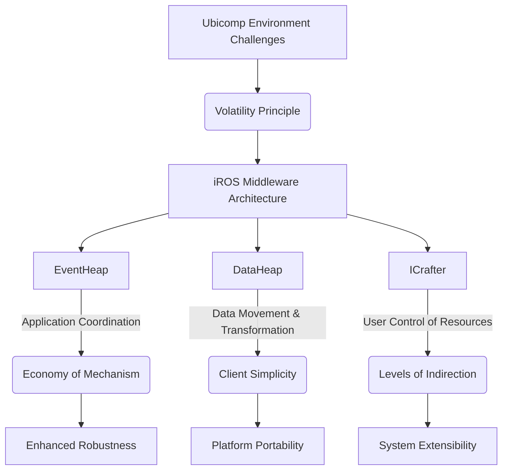

## Executive Summary

The volatility principle (VP) states that in ubiquitous computing (ubicomp) environments, the sudden departure or arrival of a service, device, or user must be treated as normal operation rather than an exceptional failure condition. This induces severe operational heterogeneity and dynamic reconfiguration into middleware systems. This paper introduces the Interactive Workspace Operating System (iROS), a middleware architecture designed to address platform portability (R1), runtime extensibility (R2), and robustness (R3) within interactive workspaces.

The architectural foundation of iROS is constructed upon three core software engineering principles:
1. **Economy of Mechanism:** Utilizing a single, unified mechanism for coordination (EventHeap) rather than multiple disjoint protocols (e.g., separating point-to-point and publish-subscribe).
2. **Client Simplicity:** Offloading state management and complex logic from client endpoints to centralized or distributed infrastructure nodes.
3. **Levels of Indirection:** Utilizing intermediary components to decouple specific endpoints, thereby enhancing system modularity and dynamic adaptability.

## iROS Subsystem Architecture

The research validates these principles through the specific implementation of three distinct subsystems within iROS, serving distinct logical roles in an interactive workspace.

### Component Analysis

*   **EventHeap:** Serves as the singular mechanism for application coordination. By acting as a centralized logical buffer for event matching and distribution, it reduces the implementation complexity required across diverse client platforms (Windows, macOS, WinCE, UNIX), enabling broad portability. 
*   **DataHeap:** Manages data movement and transformation. It enforces client simplicity by pushing complex format parsing and active transformation logic onto the infrastructure, allowing thin clients to interact with data types they do not natively understand.
*   **ICrafter:** Handles the user control of workspace resources.

The deployment history confirms that a logically-centralized design with physically-centralized infrastructure mechanisms enables superior extensibility and portability, ease of administration, and sufficient performance scalability for room-sized ubicomp systems.
